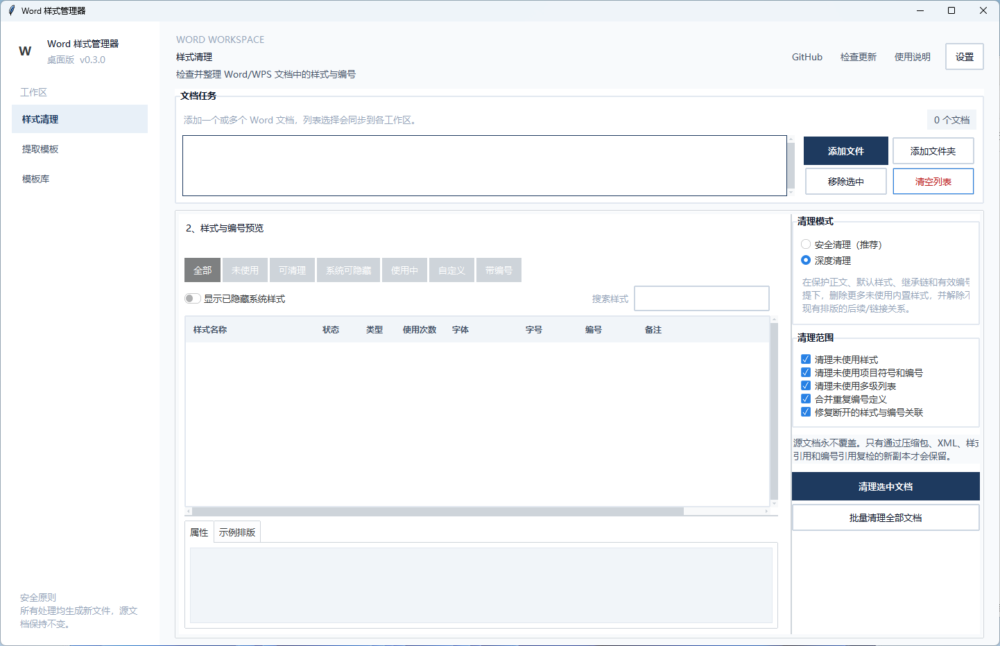
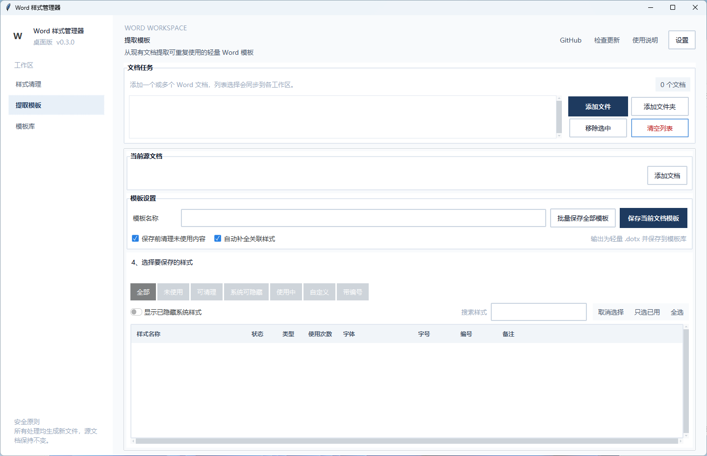
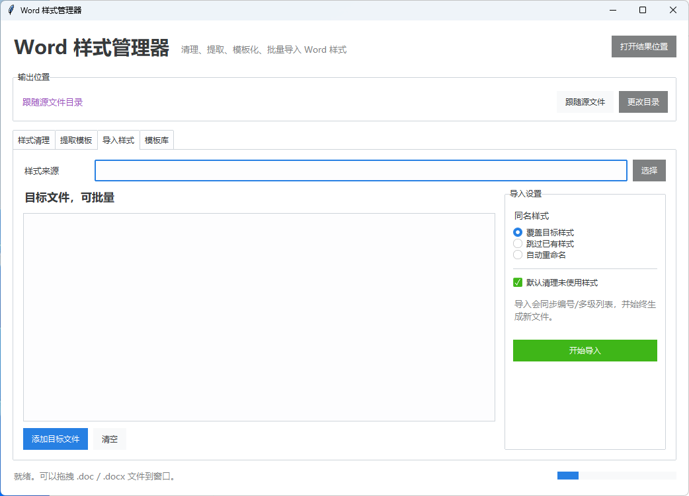
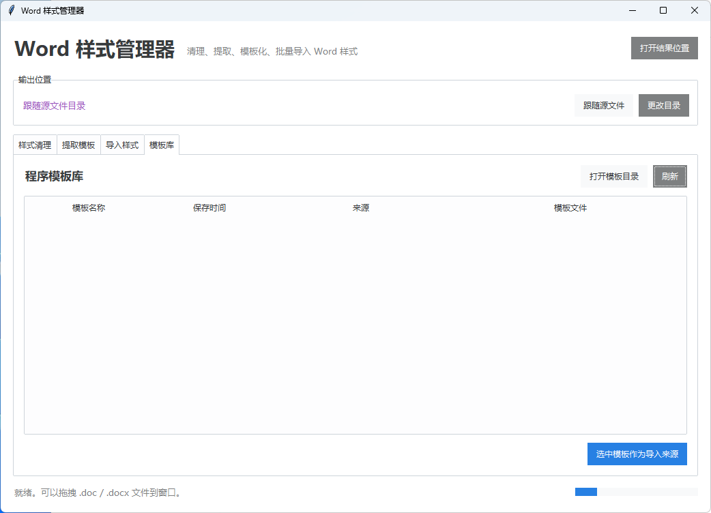

[English](README.md) | 简体中文

# 工程文档样式管理工具 / Engineering Word Toolkit v0.2.0

面向非专业用户的文档样式管理工具，降低学习门槛，无需编程经验或 Word 高级排版知识。

项目仓库：[ysbushe/word-style-manager](https://github.com/ysbushe/word-style-manager)

[](https://github.com/ysbushe/word-style-manager/actions/workflows/tests.yml)

## 为什么开发这个项目？

很多人在日常工作、学习和科研中，经常遇到：
- 文档格式不统一
- 样式混乱
- 模板难以维护
- 重复调整格式耗费大量时间

本工具旨在帮助用户轻松标准化、整理和维护文档。

## 适用人群
- 工程人员
- 教师
- 学生
- 科研人员
- 行政办公人员
- 企业文档维护人员

无需编程经验。

## 核心功能
- 清理未使用样式、项目符号、编号和多级列表
- 导出现有 Word 文档的全部或指定样式
- 从模板库或外部文件批量导入全部或指定样式
- 自动补选样式依赖并同步多级编号
- 属性预览与固定示例文字排版预览
- 独立模板编辑器和模板版本管理
- 常用/自定义多级编号方案，支持 1-9 级和样式自动绑定
- 文件夹批处理、任务方案保存和重复套用
- 导入预检与 HTML 处理报告
- 可自定义模板库和输出目录
- 程序内打开 GitHub 仓库、手动检查更新和每日自动检查更新
- 绿色版可从 GitHub Release 下载新版并自动替换重启，同时保留本地配置与模板

## 适用场景
- 工程文档
- 论文
- 报告
- 教学材料
- 企业文档
- 行政公文

## 截图

### 样式清理


### 提取模板


### 导入样式


### 模板库


## 安装
```bash
pip install -r requirements.txt
```

## 使用
```bash
python main.py
```

## 自动更新

- 可通过窗口右上角的“GitHub”按钮打开项目仓库。
- 点击“检查更新”会读取仓库最新的 GitHub Release。
- 默认每天自动检查一次，可在窗口底部关闭。
- 绿色版发现新版后可以直接下载、退出、替换程序文件并自动重启。
- 自动更新会保留 `cleaner_config.json` 和 `templates` 模板库。
- 源码运行模式只提示并打开 Release 页面，不会覆盖源码。
- 发布新版时应在 GitHub Release 中上传名称包含“绿色版”或 `portable` 的 ZIP 附件。

## 项目结构
```
├── src/ewt/                # 核心代码
│   ├── config.py           # 配置常量
│   ├── core/               # 核心引擎
│   │   ├── style_engine.py # 样式清理与分析
│   │   ├── numbering.py    # 编号/多级列表
│   │   ├── templates.py    # 模板导出/导入/库管理
│   │   ├── editor.py       # 模板样式与多级编号编辑
│   │   └── reports.py      # HTML 报告
│   ├── ui/                 # GUI
│   │   ├── app.py          # 主窗口
│   │   ├── dialogs.py      # 弹窗
│   │   ├── template_editor.py # 模板编辑器
│   │   └── widgets.py      # 预览和复用组件
│   └── utils/              # 工具
│       ├── helpers.py      # XML 辅助
│       └── word_io.py      # Word 读写
├── tests/                  # 测试
├── main.py                 # 入口
├── pyproject.toml
└── requirements.txt
```

## 依赖
- Python 3.10+
- python-docx、lxml — OOXML 处理
- ttkbootstrap、tkinterdnd2 — GUI
- pywin32 — .doc → .docx 转换（需 Microsoft Word）

## 许可
MIT License. 详见 [LICENSE](LICENSE).
