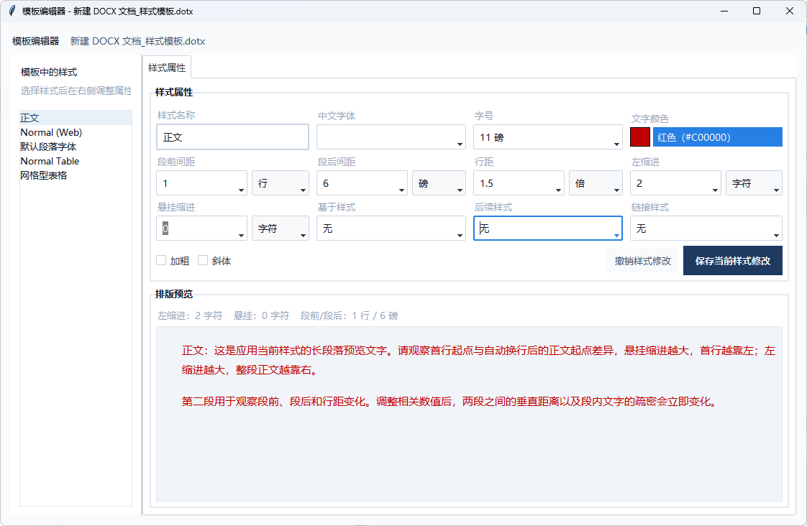

[简体中文](README.zh-CN.md) | [English](README.md)

# Word 样式管理器 v0.3.0

面向非专业用户的文档样式管理工具，降低学习门槛，无需编程经验或 Word 高级排版知识。

项目仓库：[ysbushe/word-style-manager](https://github.com/ysbushe/word-style-manager)

[](https://github.com/ysbushe/word-style-manager/actions/workflows/tests.yml)

## 为什么开发这个项目？

很多人在日常工作、学习和科研中，经常遇到：
- 文档格式不统一
- 样式混乱
- 模板难以维护
- 重复调整格式耗费大量时间

本工具旨在帮助用户轻松标准化、整理和维护文档。

## 适用人群
- 不擅长 Word/WPS 排版，希望减少手工调整的普通用户
- 工程人员
- 教师
- 学生
- 科研人员
- 行政办公人员
- 企业文档维护人员

无需编程经验。

## v0.3.0 更新内容

- 重新设计办公风格界面，扩大样式列表和排版预览区域
- 新增安全清理与深度清理，进一步清理无用样式、编号和多级列表
- 清理后自动检查文档包、XML、样式引用和编号引用，异常结果不会保留
- 模板编辑器支持常用单位、颜色预览、实时排版预览、撤销和直接保存
- 模板库增加完整名称、保存时间、编辑和删除操作
- 默认模板库改为“我的文档\模板库”，绿色版移动或更新不影响模板
- 增强绿色版更新：校验下载大小和 ZIP 完整性，阻止危险路径，更新失败自动恢复

## 核心功能
- 清理未使用样式、项目符号、编号和多级列表
- 提供安全清理与深度清理：默认保留完整编辑关系，深度模式在复检保护下删除更多未使用内置样式
- 清理结果始终生成新副本，并复检压缩包、XML、样式引用和编号引用
- 隐藏未使用的系统样式，并允许 Word/WPS 在样式被使用时重新显示
- 将现有 Word 文档的全部或指定样式提取为单个轻量 `.dotx` 模板
- 自动补选提取样式所需的关联样式
- 样式清理和模板库提供属性与示例排版预览
- 预览统计可区分未使用、可清理和可隐藏系统样式，支持显示已隐藏系统样式
- 独立模板编辑器和模板版本管理
- 中文化样式名称和模板编辑器
- 模板编辑属性使用 Word/WPS 常见单位：厘米、毫米、磅、行、字符和倍数行距
- 模板编辑器支持实时预览、撤销和直接保存当前样式
- 单文档或批量提取模板，可选择是否先清理未使用样式与编号
- 文件夹批处理和重复套用
- 可自定义模板库和输出目录
- 程序内打开 GitHub 仓库、使用说明和手动检查更新
- 绿色版可从 GitHub Release 下载新版并自动替换重启，同时保留本地配置与模板

## 适用场景
- 工程文档
- 论文
- 报告
- 教学材料
- 企业文档
- 行政公文

## 截图

### 样式清理
查看样式使用状态，选择安全清理或深度清理，并生成经过复检的新文档。


### 提取模板
从当前文档选择需要保留的样式，生成轻量 `.dotx` 模板并保存到模板库。


### 模板编辑器
编辑字体、字号、颜色、段距、行距和缩进，并实时查看排版效果。



### 模板库
集中查看、编辑和删除已保存模板，模板名称及保存时间完整显示。


## 安装
```bash
pip install -r requirements.txt
```

## 使用
```bash
python main.py
```

## 自动更新

- 可通过窗口右上角的“GitHub”按钮打开项目仓库。
- 点击“检查更新”会读取仓库最新的 GitHub Release。
- 程序不会自动联网检查，只有点击“检查更新”时才会访问 GitHub。
- 绿色版发现新版后可以直接下载、退出、替换程序文件并自动重启。
- 更新前会备份现有程序文件；下载不完整、压缩包损坏、路径异常或替换失败时会停止更新或恢复旧版。
- 自动更新会保留程序目录中的 `cleaner_config.json`；模板默认保存在“我的文档\模板库”，不会随程序替换。
- 旧版若使用程序目录中的 `templates`，首次启动新版时会将其中的 `.dotx` 模板安全复制到新默认目录，不覆盖同名文件。
- 源码运行模式只提示并打开 Release 页面，不会覆盖源码。
- 发布新版时应在 GitHub Release 中上传名称包含“绿色版”或 `portable` 的 ZIP 附件。

## 项目结构
```
├── src/ewt/                # 核心代码
│   ├── config.py           # 配置常量
│   ├── core/               # 核心引擎
│   │   ├── style_engine.py # 样式清理与分析
│   │   ├── numbering.py    # 编号/多级列表
│   │   ├── templates.py    # 模板导出与模板库管理
│   │   ├── editor.py       # 模板样式编辑
│   │   └── reports.py      # HTML 报告
│   ├── ui/                 # GUI
│   │   ├── app.py          # 主窗口
│   │   ├── dialogs.py      # 弹窗
│   │   ├── template_editor.py # 模板编辑器
│   │   └── widgets.py      # 预览和复用组件
│   └── utils/              # 工具
│       ├── helpers.py      # XML 辅助
│       └── word_io.py      # Word 读写
├── tests/                  # 测试
├── main.py                 # 入口
├── pyproject.toml
└── requirements.txt
```

## 依赖
- Python 3.10+
- python-docx、lxml — OOXML 处理
- ttkbootstrap、tkinterdnd2 — GUI
- pywin32 — .doc → .docx 转换（需 Microsoft Word）

## 使用说明

完整操作说明见 [使用说明.md](使用说明.md)。

## 许可
本程序采用 MIT License，详见 [LICENSE](LICENSE)。第三方依赖及其许可证说明见
[THIRD_PARTY_NOTICES.md](THIRD_PARTY_NOTICES.md)。
